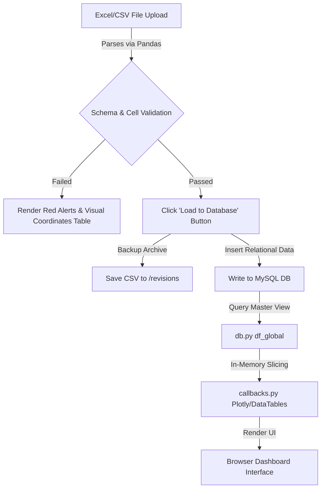

# Study Report: MyTVS Insurance Analytics Dashboard
**Date:** 22/06/2026  
**Author:** TVS Analytics Engineering Group  
**Target Audience:** Engineering Lead & Chief Executive Officer (CEO)

---

## 1. Executive Business Summary (The Storytelling)

### The Pain Point (Before the Dashboard)
Historically, managing insurance brokerage data was an operational bottleneck characterized by:
* **Manual Splicing**: Operations teams spent hours combining client lists, carrier tables, policies, and commission statements in Excel.
* **Delayed Decision Making**: Financial reports were batch-compiled monthly. If a specific product category (like Motor 2W) experienced a sudden surge in claims in a particular region (like Maharashtra), leadership wouldn't find out until weeks later, risking significant underwriting losses.
* **Data Vulnerability**: Uploading new policy spreadsheets was prone to human error (typos, negative values, chronological inconsistencies like expiry dates preceding issue dates). Bad data corrupts database integrity and invalidates reporting.

### The Cure (The Analytics Dashboard)
The **MyTVS Insurance Analytics Dashboard** transforms raw data into a real-time strategic asset:
* **Plugging Revenue Leaks**: The **Portfolio Renewals** engine categorizes upcoming policy expirations (0–30 days, 31–60 days, etc.) so sales teams can secure renewals proactively before clients churn.
* **Dynamic Margin Monitoring**: Tracks core insurance metrics (like ICR) live on-screen, allowing leadership to instantly spot loss-making carriers or regions and optimize broker placement.
* **Self-Service Upload Guardrails**: The **Data Manager** validates uploaded CSV/Excel files automatically. Operational users see exactly where errors occur in a visual grid, preventing bad data from entering MySQL, while enabling fast correction.

---

## 2. Application Architecture & Workflow

The dashboard utilizes a standard model-view-controller (MVC) style structure built on Python's **Dash** (Plotly) framework:



### Flow Breakdown:
1. **Frontend Presentation**: Written in Python using Dash components. It builds HTML structures, Bootstrap layouts, and Plotly Express charts, compiling them to React/HTML/CSS in the browser.
2. **Dynamic In-Memory Filtering**: Dashboard updates (tabs, dropdowns, slider inputs) trigger callbacks. The app retrieves the master dataset and runs **Pandas** queries in memory for sub-second page updates.
3. **Database Write Pipeline**: Staged files are split by standard relational logic and loaded into MySQL via SQLAlchemy.

---

## 3. SQL Relational Model & Query Explanation

The application operates on a normalized relational schema within the `insurance_brokerage` database containing 8 tables:
* `clients`: Demographics, types (B2C/B2B), and region coding.
* `carriers`: Underwriters (e.g., HDFC, ICICI).
* `products`: Categories (Motor, Health, Home, etc.) and sub-categories.
* `policies`: Core ledger containing issue/expiry dates, premiums, and keys to clients/products.
* `claims`: Insurance claim approvals and quotes.
* `commission_rates` & `sales_commissions`: Commission payouts and parameters.
* `backoffice_users`: Logged agents.

### The Master Data Query ([db.py](file:///d:/TVS3_Refined_v3/tvs3_refined/db.py#L22-L53))
To construct the master dataframe `df_global` in memory, the system executes the following SQL query:

```sql
SELECT 
    p.policy_number,
    c.name as client_name,
    c.client_type,
    ca.carrier_name,
    pr.category,
    pr.sub_category,
    p.issue_date,
    p.expiry_date,
    p.premium_amount,
    p.status as policy_status,
    p.distribution_channel,
    c.region_name as region,
    IFNULL(cl.claim_amount, 0) as claim_amount,
    IFNULL(cl.status, 'No Claim') as claim_status,
    sc.calculated_amount as commission_earned
FROM policies p
JOIN clients c ON p.client_id = c.client_id
JOIN products pr ON p.product_id = pr.product_id
JOIN carriers ca ON pr.carrier_id = ca.carrier_id
LEFT JOIN (
    SELECT policy_id, SUM(quote_approved_amount) as claim_amount, MAX(status) as status 
    FROM claims 
    GROUP BY policy_id
) cl ON p.policy_id = cl.policy_id
LEFT JOIN (
    SELECT policy_id, SUM(calculated_amount) as calculated_amount 
    FROM sales_commissions 
    GROUP BY policy_id
) sc ON p.policy_id = sc.policy_id
```

### Query Analysis:
* **`JOIN clients c ON p.client_id = c.client_id`**: Associates each policy record with its client information (e.g., client type, name, and regional location).
* **`JOIN products pr ON p.product_id = pr.product_id`**: Extracts product categories (e.g., Motor, Health) and sub-categories.
* **`JOIN carriers ca`**: Links product identifiers back to underwriting companies (carriers).
* **`LEFT JOIN (SELECT policy_id, SUM(...) GROUP BY policy_id) cl`**: Sums claims approved for each policy. A `LEFT JOIN` is required because many policies have zero claims. `IFNULL(..., 0)` converts missing relationships to `0`.
* **`LEFT JOIN (SELECT policy_id, SUM(...) GROUP BY policy_id) sc`**: Aggregate commissions paid to the broker.

---

## 4. Key Business Metrics Explained

The dashboard aggregates operational data to track these vital performance indicators (KPIs):

| Metric | Business Definition | Formula | Business Impact |
| :--- | :--- | :--- | :--- |
| **Incurred Claim Ratio (ICR)** | The ratio of claims paid out to premiums written. | $\frac{\text{Total Claims}}{\text{Total Premiums}} \times 100$ | **Risk Control**: Indicates profitability. An ICR > 70% means high loss exposure, prompting renegotiation or premium adjustment. |
| **Underwriting Profit** | Net profit left after subtracting payouts from revenue. | $\text{Premiums} - (\text{Claims} + \text{Broker Commissions})$ | **Financial Health**: Evaluates whether carrier policies are net-positive. |
| **Commission Margin** | The percentage of premium earned as broker commission. | $\frac{\text{Commissions Earned}}{\text{Premium Amount}} \times 100$ | **Efficiency**: Measures broker revenue conversion from written policies. |

---

## 5. Summary of Recent Dashboard Enhancements

During this session, we refactored the uploader code to improve usability and add safety features:

### 1. Replaced Manual Checklist with Automated Loading
* **Old Behavior**: Users had to check 13 separate schema checkboxes manually before the loading button became active.
* **New Behavior**: As soon as a file is uploaded, the app automatically checks the schema. If valid, it immediately unlocks a green **"Load to Database"** button.

### 2. Live Raw Data Preview on Failed Uploads
* **Old Behavior**: When an upload failed validation, the grid remained blank.
* **New Behavior**: The grid now renders the uploaded raw data immediately, allowing users to scroll and see what columns are present even when the upload fails.

### 3. Visual Error Markers & Highlights
* **Unrecognized Column Coloring**: If an uploaded column name doesn't match the allowed schema, its header displays a warning indicator `Header Name ⚠️ (Unrecognized)` and the entire column is highlighted in a soft warning red.
* **Specific Cell Highlighting**: Row-level errors (like negative numbers or empty columns) are mapped back to their original columns and highlighted in **bold red text** in the preview table.
* **Load Button Suppression**: If any schema or cell validation errors are present, the **"Load to Database"** button is completely hidden (`display: none`) to prevent inserting bad data.

---

## 6. Project Files Map

Here are the primary files composing the application:
* [app.py](file:///d:/TVS3_Refined_v3/tvs3_refined/app.py) - Entry point. Initializes callbacks and runs the Flask local dev server.
* [dash_app.py](file:///d:/TVS3_Refined_v3/tvs3_refined/dash_app.py) - Initializes the Dash app object, loads stylesheets, and configures Flask caching.
* [layouts.py](file:///d:/TVS3_Refined_v3/tvs3_refined/layouts.py) - Declares sidebar navigation and header components.
* [charts.py](file:///d:/TVS3_Refined_v3/tvs3_refined/charts.py) - Houses the visualizations and tab-specific layouts, including the Data Ingestion Wizard (`tab13`).
* [callbacks.py](file:///d:/TVS3_Refined_v3/tvs3_refined/callbacks.py) - Manages app reactivity, handles data validation, and commits uploads to the database.
* [db.py](file:///d:/TVS3_Refined_v3/tvs3_refined/db.py) - Database connector. Connects via PyMySQL and contains fallback mechanisms.
* [db_writer.py](file:///d:/TVS3_Refined_v3/tvs3_refined/db_writer.py) - Data Normalizer. Accepts flat data, maps schema formats, and loads records into relational MySQL tables.

---

## 7. Business Analysis & Dashboard Elements Map

This section serves as a directory of the dashboard's modular structure, detailing the specific business purpose of each category and tab:

### Group A: Overview (Top-Line Growth)
* **Executive Summary**:
  * **Business Purpose**: Gives the CEO a 5-second health check of the business.
  * **Key Components**: KPI cards showing Total Premium, Active Policies, Gross Commission, and Incurred Claim Ratio (ICR). Includes month-on-month trend lines.
* **Growth & Renewals**:
  * **Business Purpose**: Tracks sales velocity and premium expansions.
  * **Key Components**: Bar charts visualizing month-over-month premium gains and percentage changes to identify seasonality.
* **Targeting Engine**:
  * **Business Purpose**: Helps sales teams identify high-value cohorts for campaigns.
  * **Key Components**: Segment matrices categorizing B2B/B2C premiums by carrier to focus marketing resources where premiums are highest.

### Group B: Clients (Customer Profiles)
* **Channel Mix**:
  * **Business Purpose**: Evaluates distribution channel efficiency (Direct, Online, Broker).
  * **Key Components**: Treemaps and pie charts displaying premium share per channel. Allows optimization of acquisition budgets.
* **Top Clients**:
  * **Business Purpose**: Key Accounts Management. Identifies critical corporate relationships.
  * **Key Components**: Ranked bar chart showing the highest-paying corporate accounts, enabling dedicated retention plans for high-value clients.

### Group C: Products (Productivity & Margins)
* **Carrier Scorecard**:
  * **Business Purpose**: Vendor management. Evaluates which underwriters (e.g., HDFC, ICICI) are most profitable.
  * **Key Components**: Grid scoring carriers on written premiums versus claims approved and underwriting margin.
* **Product Mix**:
  * **Business Purpose**: Evaluates product demand (Motor, Health, Home, Travel).
  * **Key Components**: Category breakdown charts showing premium volume by line of business.

### Group D: Risk & Claims (Loss Control)
* **High Risk Register**:
  * **Business Purpose**: Identifies high-exposure policies.
  * **Key Components**: Lists policies with active claims, high claim values, or pending doc inspections, allowing operations to audit risks.
* **Claims Overview & Breakdown**:
  * **Business Purpose**: Controls claim payout cycles and operational efficiency.
  * **Key Components**: Stages tracking (Registered $\rightarrow$ Approved $\rightarrow$ Settled) and claim-volume charts to monitor loss ratios by carrier.

### Group E: Profitability & Margins (Financial Performance)
* **Profitability Trends**:
  * **Business Purpose**: Visualizes the net cash flow of our broker operations.
  * **Key Components**: Compares earned broker commissions against company overhead and underwriting margins over monthly periods.
* **Margin Analysis**:
  * **Business Purpose**: Determines which products yield the highest commission percentages.
  * **Key Components**: Bar charts ranking margin rates by product category, pointing out which segments are most profitable per rupee spent.

### Group F: Regional Analytics (Market Slicing)
* **Regional Analytics**:
  * **Business Purpose**: Decides regional expansion and localization.
  * **Key Components**: Geographic bar charts tracking written premiums and claim losses across states (MH, DL, TN, etc.), highlighting highly profitable regions.

### Group G: Explorer (Self-Service)
* **Pivot Explorer**:
  * **Business Purpose**: Ad-hoc reports. Allows senior managers to run custom queries without developer assistance.
  * **Key Components**: Matrix aggregator and heatmaps matching custom dimensions (e.g., client type vs. region) against numeric targets (e.g., claim amount).

